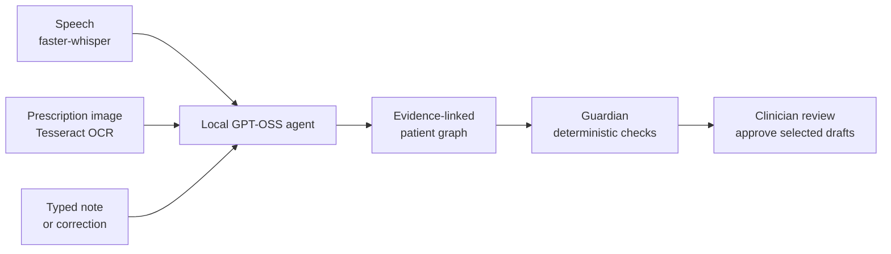

# MedSignal

**MedSignal is a local-first clinical intelligence assistant for hospital teams.** It turns clinician-confirmed encounter facts into an evidence-linked patient timeline, runs deterministic safety checks, and prepares clinician-approved drafts for documentation, handoff, billing review, and patient debriefs.

> **Important:** Every record in this repository is synthetic. MedSignal is clinical decision support, not a diagnosis, prescription, or autonomous medication-safety system.

## Why MedSignal

At the bedside, important context can be spread across a conversation, an old chart entry, a prescription photograph, and an open order. MedSignal connects those signals into one reviewable patient story before a missed connection becomes harm.

It is designed for environments where privacy and clinical control matter: runtime inference, transcription, OCR, safety rules, and storage remain on the local MedSignal host.

## Built with GPT-5.6 and Codex

We used GPT-5.6 in Codex as a **specification-driven development (SDD)** collaborator: turning product ideas into explicit workflows, building them, and validating the result.

- **From specs to product decisions:** Codex helped translate the bedside flow of capture → evidence → safety checks → clinician approval into acceptance criteria and screen/API behavior. We chose a local-first design, source-linked facts, and clinician-controlled approvals as non-negotiable product boundaries.
- **Engineering the workflow:** Codex accelerated the React and FastAPI implementation, local agent tool orchestration, SQLite-backed patient graph, OCR/transcription integration, and reviewable draft bundles.
- **Safety and quality:** Codex helped implement deterministic Guardian rules, audit-linked corrections, and repeatable tests for medication risks, contradictions, routing, and billing-code validation. We deliberately kept safety decisions in deterministic code rather than the model.
- **Design and iteration:** Codex supported UI refinement, debugging, and documentation, including the local architecture and judge walkthrough, so the technical design remained understandable and testable.

The team made the final product, engineering, and design decisions. GPT-5.6 and Codex were used during development only, not in the runtime patient-care workflow. At runtime, MedSignal uses local `gpt-oss:20b`, deterministic code, and clinician review.

## Local clinical workflow agent

One clinician input creates a reviewable draft bundle without sending patient context to a cloud model:

### Architecture diagram


A detailed component and request-lifecycle reference is available in [docs/architecture.md](docs/architecture.md).



**Everything runs locally. Only clinician-approved work is committed to the record.**

1. **Capture locally.** A clinician speaks, types, or photographs a prescription. Faster-whisper and Tesseract convert speech and images to text on-device.
2. **Organize the encounter.** The local agent extracts source-linked facts, updates the patient graph, and prepares a reviewable bundle: clinical note, safety checks, billing candidates, SBAR handoff, and patient explanation.
3. **Verify in code.** Guardian applies deterministic rules to detect medication risks, contradictions, and incomplete follow-ups. The model never makes the safety decision.
4. **Keep the clinician in control.** Every note, code, handoff, patient summary, reminder, and order action remains a draft until explicitly approved. Corrections are audit-linked; nothing is silently overwritten.

## Patient knowledge graph

MedSignal keeps an evidence-linked local graph of each patient's recorded facts, so Guardian can surface conflicts for clinician review instead of relying on memory alone.


## Safety and privacy boundary

- Runtime inference, OCR, safety rules, and SQLite storage remain on the local MedSignal host.
- `gpt-oss:20b` is the language and orchestration layer: it structures stated facts, calls approved local tools, and drafts language.
- Deterministic code in [`core/curated.py`](core/curated.py) and [`core/guardian.py`](core/guardian.py) owns medication categories, interaction rules, clinical alerts, and billing-code validation.
- Every Guardian alert is source-linked and explicitly requires clinician review.
- Public traces show tool names, semantic arguments, and outcome summaries. Private reasoning is neither persisted nor displayed.
- Patient-facing summaries restate only clinician-confirmed, source-grounded facts.

## Key modules

- [`core/agent.py`](core/agent.py): bounded tool orchestration, draft bundles, approval commits, and trace persistence.
- [`core/guardian.py`](core/guardian.py): deterministic allergy, interaction, contradiction, and overdue-order checks.
- [`core/curated.py`](core/curated.py): auditable clinical and coding lookup tables.
- [`core/vision.py`](core/vision.py): local image validation and Tesseract OCR; `gpt-oss` receives extracted text, not images.
- [`features/agent.py`](features/agent.py): run, upload, review, trace, and recent-run APIs.
- [`web/src/views/AgentRunView.jsx`](web/src/views/AgentRunView.jsx): unified clinician capture and approval workflow.
- [`eval/agent_eval.py`](eval/agent_eval.py): repeatable route, cross-modal safety, and coding validation checks.

## Run MedSignal locally

### Prerequisites

- Python 3.11+
- Node 22.12+
- [Ollama](https://ollama.com)
- [Tesseract](https://github.com/tesseract-ocr/tesseract)

Tested demo setup on macOS with Homebrew:

```bash
brew install python@3.11 node ollama tesseract
```

Clone the repository and install the local runtime model:

```bash
git clone https://github.com/jenishk20/MedSignal.git
cd MedSignal

ollama pull gpt-oss:20b
```

Install backend and frontend dependencies, then build the frontend:

```bash
python3.11 -m venv .venv
source .venv/bin/activate
pip install -r requirements.txt

npm --prefix web install
npm --prefix web run build
```

Start the application:

```bash
./run.sh
```

The launcher starts and warms the local model, then serves the app at [http://localhost:8000](http://localhost:8000). No OpenAI API key or cloud account is required at runtime. On first launch, MedSignal automatically seeds synthetic demo data.

## Synthetic demo accounts

| Workspace | Username | Password | What to test |
|---|---|---|---|
| Clinician workspace | `doctor` | `confide` | María’s evidence-linked record, agent workflow, Guardian checks, review, and approval flow. |
| Patient space | `maria` | `confide` | Spanish-language patient questions, clinician-approved summaries, and consent explanations. |

All seeded records are synthetic and are included solely for demonstration and testing.

## Suggested judge walkthrough

1. Sign in to the clinician workspace as `doctor` and open **María González**.
2. Run a bedside workflow from speech, typed text, or a prescription image; inspect the trace, source-linked facts, Guardian signals, and approval controls.
3. Open the patient space as `maria` to verify Spanish-language answers and patient-facing summaries.
4. Return to the clinician workspace and open **Consent** to generate and hear a clinician-reviewed explanation in the patient's portal language.

## Verification

Run these commands from an activated virtual environment:

```bash
python -m pytest tests -q
python -m eval.run_eval --only agent,coding --no-model
python -m compileall -q core features app.py
npm --prefix web run build
```

The agent evaluation verifies required tools across workflows, confirms that the synthetic prescription scenario produces the expected critical deterministic alert, and checks that billing suggestions contain only curated, validated codes.

---

The repository and product are named **MedSignal**. Some local development paths and backward-compatible database settings still use the older `caretrace` name.
