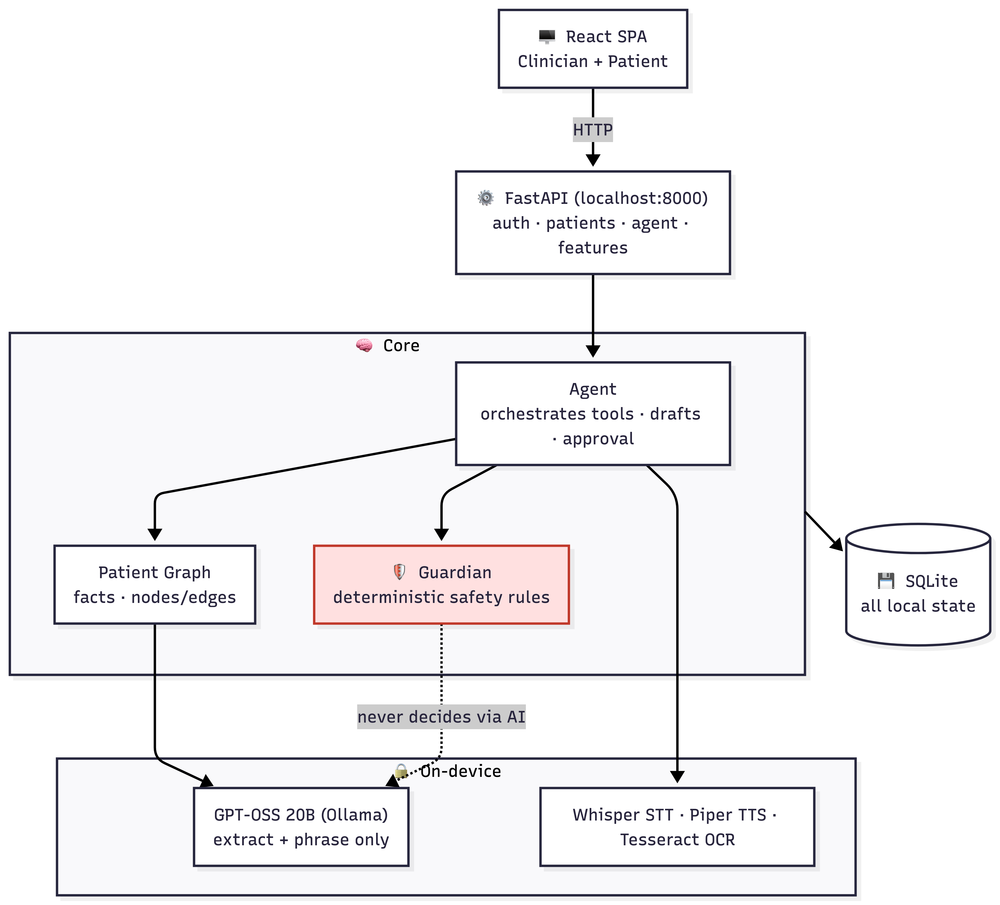
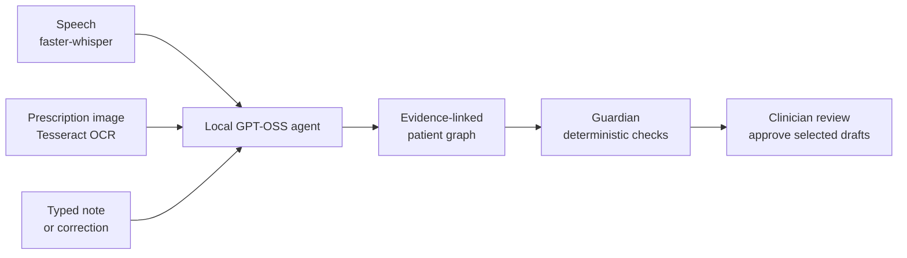
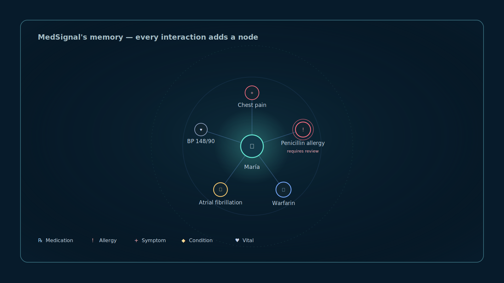

# MedSignal

MedSignal is a local-first clinical intelligence assistant for hospital teams. It turns clinician-confirmed encounter facts into an evidence-linked patient timeline, runs deterministic safety checks, and produces clinician-approved drafts for documentation, handoff, billing review, and patient debriefs.

All demo records are synthetic. MedSignal is clinical decision support, not a diagnosis, prescription, or autonomous medication-safety system.

## Built with Codex and GPT-5.6

- **Agentic workflows:** Codex and GPT-5.6 accelerated the design and implementation of the bounded local agent that turns speech, images, and text into reviewable, source-linked drafts.
- **Local runtime model:** MedSignal runs `gpt-oss:20b` through Ollama on the local machine, alongside local transcription, Tesseract OCR, and SQLite storage—so patient context stays in the care environment.
- **Safety by design:** We used Codex to help implement and test the boundary between model-generated language and deterministic Guardian rules for medication risks, contradictions, and incomplete follow-ups.
- **Clinician control and evaluation:** Codex and GPT-5.6 accelerated the React/FastAPI workflow, approval boundaries, debugging, and the repeatable evaluation harness that checks routes, safety signals, grounded outputs, and validated billing drafts.

GPT-5.6 and Codex were used during development. They are not part of the runtime patient-care workflow: at runtime, MedSignal uses the local `gpt-oss:20b` model, deterministic code, and clinician review.

## Local clinical workflow agent

One clinician input becomes a complete, local, clinician-reviewed workflow—without sending patient context to the cloud.

### Architecture diagram



A detailed component and request-lifecycle reference is available in [docs/architecture.md](docs/architecture.md).



**Everything runs locally. Only clinician-approved work is committed to the record.**

1. **Capture locally.** A clinician speaks, types, or photographs a prescription. Faster-whisper and Tesseract convert speech and images to text on-device.
2. **Organize the encounter.** The local GPT-OSS agent extracts source-linked facts, updates the patient graph, and prepares a reviewable bundle: clinical note, safety checks, billing candidates, SBAR handoff, and patient explanation.
3. **Verify in code.** Guardian applies deterministic rules to detect medication risks, contradictions, and incomplete follow-ups. The model never makes the safety decision.
4. **Keep the clinician in control.** Every note, code, handoff, patient summary, reminder, and order action remains a draft until explicitly approved. Corrections are audit-linked; nothing is silently overwritten.

## Patient knowledge graph

MedSignal keeps an evidence-linked local graph of each patient's recorded facts, so the Guardian can surface conflicts for clinician review instead of relying on memory alone.



## Safety and privacy boundary

- Runtime inference, OCR, safety rules, and SQLite storage stay on the local MedSignal host.
- `gpt-oss:20b` is the language layer only: it structures stated facts and drafts language.
- Deterministic code in `core/curated.py` and `core/guardian.py` owns medication categories, interaction rules, clinical alerts, and billing-code validity.
- Every Guardian alert is source-linked and requires clinician review.
- Public traces show tool names, semantic arguments, and outcome summaries. Private reasoning is never persisted or shown.
- Patient-facing summaries restate only clinician-confirmed, source-grounded facts.

## Key modules

- `core/agent.py` — bounded tool orchestration, draft bundle construction, approval commits, and trace persistence.
- `core/guardian.py` — deterministic allergy, interaction, contradiction, and overdue-order checks.
- `core/curated.py` — auditable clinical and coding lookup tables.
- `core/vision.py` — local image validation and Tesseract OCR; gpt-oss receives text, never images.
- `features/agent.py` — run, upload, review, trace, and recent-run APIs.
- `web/src/views/AgentRunView.jsx` — unified clinician capture and approval workflow.
- `eval/agent_eval.py` — repeatable route, cross-modal safety, and coding validation checks.

## Run MedSignal locally

**Supported demo platform:** macOS with Apple Silicon, Python 3.11+, Node 22.12+, Ollama, and Tesseract. The application is local-first: no OpenAI API key or cloud account is required at runtime.

1. **Clone the repository and enter it.**

   ```bash
   git clone https://github.com/jenishk20/MedSignal.git
   cd MedSignal
   ```

2. **Install local prerequisites.** On macOS with Homebrew:

   ```bash
   brew install python@3.11 node ollama tesseract
   ```

3. **Install the local runtime model.**

   ```bash
   ollama pull gpt-oss:20b
   ```

4. **Install MedSignal's backend and frontend dependencies.**

   ```bash
   python3.11 -m venv .venv
   source .venv/bin/activate
   pip install -r requirements.txt
   npm --prefix web install
   npm --prefix web run build
   ```

5. **Start the application.** The launcher starts Ollama with the demo performance settings, warms the local model, and serves the app.

   ```bash
   ./run.sh
   ```

6. **Open the local app.** Visit [http://localhost:8000](http://localhost:8000). On the first launch, MedSignal seeds synthetic demo data automatically.

### Synthetic demo accounts

| Workspace | Username | Password | What to test |
| --- | --- | --- | --- |
| Clinician workspace | `doctor` | `confide` | María's evidence-linked record, agent workflow, Guardian checks, review, and approval flow. |
| Patient space | `maria` | `confide` | Spanish-language patient questions, care summaries, and consent explanations. |

All seeded records are synthetic and are included solely for demonstration and testing.

### Suggested judge walkthrough

1. Sign in to the clinician workspace as `doctor` and open **María González**.
2. Run a bedside workflow from speech, text, or a prescription image; review the visible trace, evidence-linked facts, Guardian signals, and draft approvals.
3. Open the patient space as `maria` to verify Spanish-language answers and patient-facing summaries.
4. Return to the clinician workspace and open **Consent** to generate and hear the consent explanation in the patient's portal language.

## Verification

```bash
python -m pytest tests -q
python -m eval.run_eval --only agent,coding --no-model
python -m compileall -q core features app.py
npm --prefix web run build
```

The agent evaluation verifies all required tools run for each workflow, the synthetic prescription scenario produces the expected critical deterministic alert, and billing suggestions contain only curated, validated codes.
