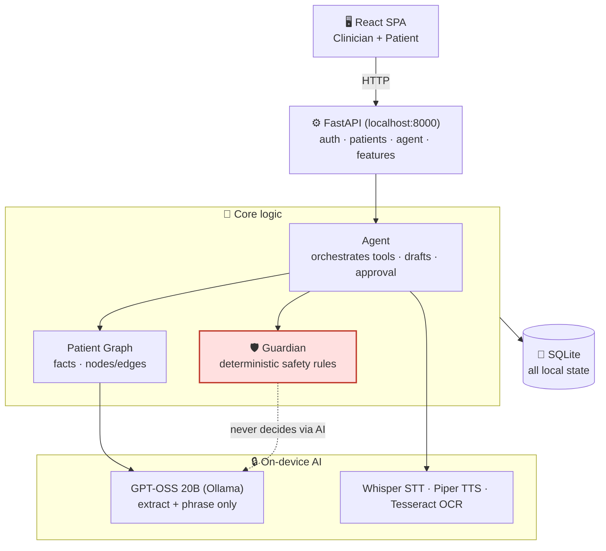
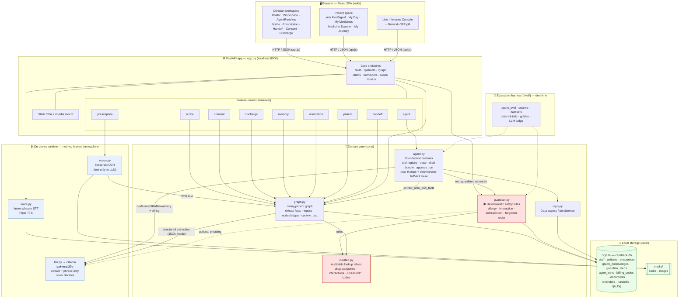
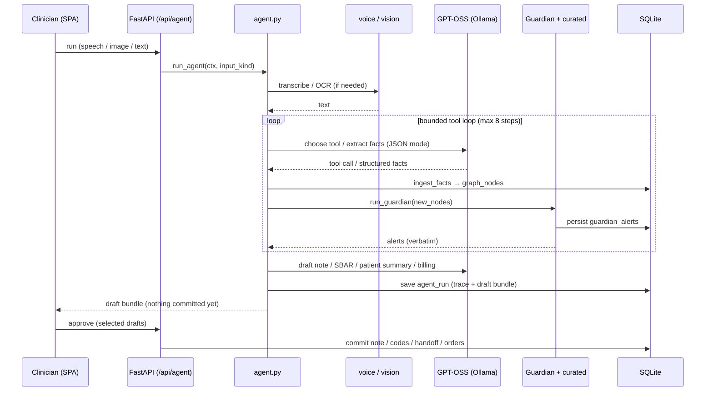

# MedSignal — Architecture

> The project folder is `caretrace`; the product was renamed **MedSignal**. The
> SQLite filename (`caretrace.db`) and the `CARETRACE_*` environment variables are
> kept as fallbacks for backward compatibility with existing local records.

MedSignal is a **local-first clinical intelligence assistant**. Every piece of AI
runs on-device — GPT-OSS 20B via Ollama, faster-whisper (STT), Piper (TTS), and
Tesseract (OCR) — and all state lives in a single local SQLite file. Nothing leaves
the machine; `/api/status` reports `network_mode: disabled`.

The central design principle is the split between the **language layer** and the
**decision layer**:

- **GPT-OSS (`core/llm.py`)** only *extracts* structured facts and *phrases*
  sentences. It never decides whether something is clinically unsafe.
- **The Guardian (`core/guardian.py`)** makes every clinical judgment
  *deterministically* against **curated lookup tables** (`core/curated.py`), so
  alerts are auditable rather than hallucinated.
- **The agent (`core/agent.py`)** orchestrates a bounded set of tools (max 8 steps,
  with a hard-coded deterministic fallback route). Everything it produces stays a
  **draft until a clinician approves it** (`approve_run`).

## Overview (at a glance)

## Detailed system diagram

## One agent run — request lifecycle

